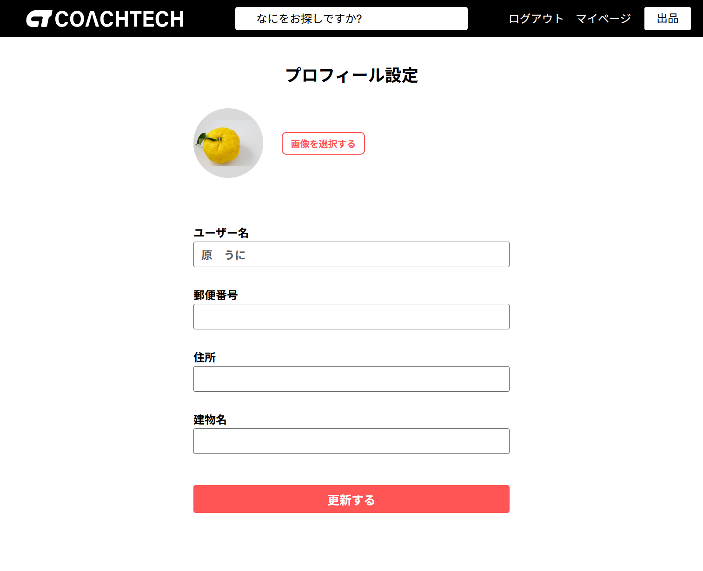
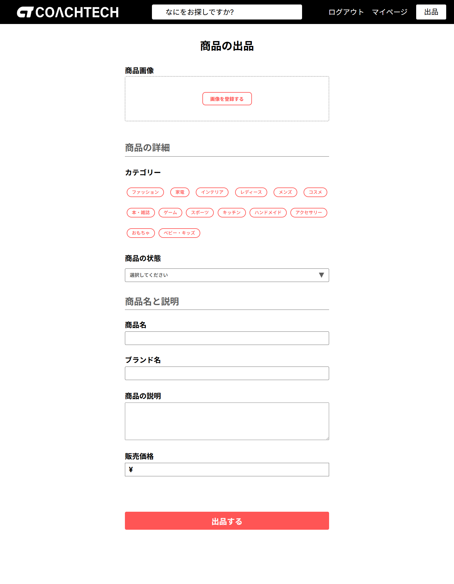

COACHTECH フリマ

<p align="center">
                
</p>

### サービス概要

企業が開発した独自のフリマアプリです。アイテムの出品と購入を行うことを目的としています。

### 制作の背景と目的

- シンプルで使いやすい

### 制作の目標

- 初年度でのユーザー数 1000 人達成

### 主な機能一覧

### 認証機能

- ユーザー登録・ログイン
- メール認証
- Laravel Fortify による認証システム

### 機能紹介

- ユーザー登録

<p align="center">
    
</p>

- メール認証誘導画面

<p align="center">
    
</p>

- ログイン

<p align="center">
    
</p>

- 商品一覧画面（トップ）-未ログイン、ログイン後

<p align="center">
    
</p>

- プロフィール設定画面\_初回ログイン時

<p align="center">
    
</p>

- 商品詳細画面-ログイン後

<p align="center">
    
</p>

- 商品出品画面

<p align="center">
    
</p>

- プロフィール画面

<p align="center">
    
</p>

- プロフィール編集画面

<p align="center">
    
</p>

- 商品購入画面

<p align="center">
    
</p>

- 送付先住所変更画面

<p align="center">
    
</p>

### 開発言語・フレームワーク

- **開発言語**: PHP
- **フレームワーク**: Laravel 8.x
- **データベース**: MySQL
- **バージョン管理**: GitHub
- **コンテナ化技術**: Docker
- **メールテスト**: MailHog

### 開発プロセス

- 設計 → コーディング → テスト

### ER 図


### 環境構築

- **PHP**: 8.3.6 (ホスト) / 8.1.33 (コンテナ)
- **MySQL**: 8.0.26
- **Composer**: 2.8.11
- **Docker**: 28.5.1
- **Laravel Framework**: 8.83.29

- ＊ご使用の PC に合わせて各種必要なファイル(.env や docker-compose.yml 等)は作成、編集してください。

### セットアップ手順

####クローン作製手順

1. Github リポジトリのクローン

```bash
git clone https://github.com/ponponmama/coachtech-flea-market.git
```

```bash
cd attendance-erika-hara
```

2. 必要なパッケージのインストール

```bash
sudo apt-get update
```

Docker コンテナのビルドと起動

```bash
docker-compose up -d --build
```

3. Composer を使用した依存関係のインストール

- github からクローンを作成するといくつかのフォルダが足りません。src に setup.sh を作成してあります。プロジェクトはフレームワーク内にインストールするので、先にフォルダ作成お願いします。

- 3-1. コンテナに入ります。

```bash
docker-compose exec php bash
```

- 3-2. スクリプトに実行権限を付与します。

```bash
chmod +x setup.sh
```

```bash
./setup.sh
```

- 以下のフォルダが作成されます

```
      storage/app/public/profile-images
```

<br>

#### "ディレクトリが正常に作成されました。" ← このメッセージが出ます。<br>

<br>

- 3-3 Docker 環境で PHP コンテナに入り、依存関係をインストールします。<br>

```bash
docker-compose exec php bash
```

```bash
composer install
```

<br>

4. 環境設定ファイルの設定

- .env.example ファイルを .env としてコピーし、必要に応じてデータベースなどの設定を行います。

```bash
cp .env.example .env
```

- 環境設定を更新した後、設定キャッシュをクリアするために以下のコマンドを実行します。これにより、新しい設定がアプリケーションに反映されます。

```bash
docker-compose exec php bash
```

```bash
php artisan config:clear
```

この手順は、特に環境変数が更新された後や、`.env` ファイルに重要な変更を加えた場合に重要です。設定キャッシュをクリアすることで、古い設定が引き続き使用されることを防ぎます。

5.アプリケーションキーの生成

```bash
php artisan key:generate
```

6. データベースのセットアップ

#### データベースのマイグレーション

```bash
php artisan migrate
```

7. データベースシーダーの実行

```bash
php artisan db:seed
```

＊マイグレーションとシーダーを同時に実行する場合

```bash
php artisan migrate --seed
```

## 使用方法

### ユーザーとして使用

1. **ユーザー登録**

   - 新規アカウント作成
   - メールアドレス、パスワード、名前を入力

2. **メール認証**

   - 登録後、認証メールが送信される
   - MailHog（http://localhost:8025）でメールを確認
   - 認証リンクをクリックして認証完了

3. **プロフィール設定**

   - プロフィール画像、郵便番号、住所を登録
   - 初回ログイン時にプロフィール設定画面に遷移

4. **商品の出品**

   - 商品画像、カテゴリ、商品名、ブランド名、説明、価格を入力
   - 出品完了後、商品一覧に表示される

5. **商品の購入**

   - 商品詳細画面から購入
   - 支払い方法と配送先住所を選択
   - 購入完了後、商品は「SOLD」表示になる

6. **マイリスト機能**

   - 気になる商品にいいねを追加
   - マイページでいいねした商品を確認

7. **コメント機能**
   - 商品詳細画面でコメント投稿
   - 他のユーザーとの交流が可能

## ダミーデータログイン情報

### ユーザー

- メールアドレス: test@01.com 〜 test@21.com
- パスワード: user_pass

> **注意**: これらのユーザーは `php artisan db:seed` コマンドで作成されます。

\*test@ 数字（2 桁）.com の形式　例:test@01.com, test@02.com, ..., test@21.com

※ シーダー実行後に上記アカウントが作成されます。

## テスト

### テスト実行

```bash
docker-compose exec php bash
```

```bash
php artisan test
```

### テスト項目

- **機能テスト**

  - `CommentTest.php` - コメント機能テスト（3 項目）

    - 認証ユーザーのコメント投稿
    - ゲストユーザーのコメント投稿制限
    - コメントバリデーション（必須・最大文字数）

  - `DeliveryAddressTest.php` - 配送先住所変更機能テスト（3 項目）

    - 住所変更画面での住所登録と購入画面への反映
    - 購入商品への配送先住所紐づけ
    - 住所変更画面のバリデーション

  - `EmailVerificationTest.php` - メール認証機能テスト（7 項目）

    - 会員登録後の認証メール送信
    - メール認証誘導画面の MailHog リンク
    - メール認証完了後のプロフィール画面遷移
    - 認証メール再送機能
    - 未認証ユーザーのアクセス制限
    - 認証済みユーザーの動作確認
    - 無効な認証 URL でのエラーハンドリング

  - `ItemListingTest.php` - 商品出品機能テスト（5 項目）

    - 商品出品画面での全項目保存（カテゴリ、状態、商品名、ブランド名、説明、価格）
    - 商品出品のバリデーション
    - 商品出品画面の表示確認
    - 価格のカンマ処理
    - 複数カテゴリの選択

  - `ItemsIndexTest.php` - 商品一覧機能テスト（3 項目）

    - ゲストユーザー向け全商品表示
    - 購入済み商品の SOLD バッジ表示
    - 認証ユーザーの自分の出品商品非表示

  - `LoginValidationTest.php` - ログイン認証機能テスト（5 項目）

    - メールアドレス必須バリデーション
    - パスワード必須バリデーション
    - 無効な認証情報バリデーション
    - ログイン成功

  - `LogoutTest.php` - ログアウト機能テスト（1 項目）

    - ログアウト成功

  - `MylistTest.php` - マイリスト機能テスト（3 項目）

    - いいねした商品のみ表示
    - 購入済み商品の SOLD バッジ表示
    - ゲストユーザーでのマイリスト非表示

  - `PaymentMethodTest.php` - 支払い方法選択機能テスト（1 項目）

    - 支払い方法選択の小計画面への反映

  - `PurchaseTest.php` - 商品購入機能テスト（3 項目）

    - 購入ボタンでの購入完了
    - 購入済み商品の一覧画面での SOLD 表示
    - 購入商品のプロフィール購入履歴への追加

  - `RegisterValidationTest.php` - ユーザー登録機能テスト（6 項目）

    - 名前必須バリデーション
    - メールアドレス必須バリデーション
    - パスワード必須バリデーション
    - パスワード最小文字数バリデーション
    - パスワード確認バリデーション
    - 登録成功時のプロフィール画面遷移

  - `UserProfileTest.php` - ユーザープロフィール機能テスト（5 項目）

    - プロフィール情報表示（画像、ユーザー名、出品・購入商品一覧）
    - 購入者視点での SOLD バッジ表示
    - プロフィール編集フォームの初期値表示
    - 画像なしユーザーのプロフィール編集
    - 商品なしユーザーのプロフィール表示

    全 45 項目

  \*テストで一旦 db がリセットされます。マイグレートリフレッシュとシーダーしてください。

```bash
php artisan migrate:fresh --seed
```

### メール設定

プロジェクトでは開発環境でのメール送信のテストに Mailhog を使用しています。

```
🎯 MailHogの役割
メール送信のテスト: アプリケーションから送信されたメールを実際には送信せずにキャッチ
Web UI: ブラウザでメール内容を確認できる（通常は http://localhost:8025）
開発環境専用: 本番環境では使用しない
```

※　このファイルは開発環境でメール機能をテストするために必要なツールです。本番環境にはデプロイしないでください！

- Laravel のメール設定で MailHog を SMTP サーバーとして設定
- 会員登録時の認証メールが MailHog でキャッチされる
- http://localhost:8025 でメール内容を確認できる
- テストでは Mail::fake()を使用してメール送信をモック

\*\*※　プラットフォーム: Linux 用バイナリなので、Windows/Mac ユーザーは別途ダウンロードが必要な場合があります

**1. docker-compose.yml の設定確認**

`docker-compose.yml`に既に MailHog の設定が含まれています：

```yaml
mailhog:
  image: mailhog/mailhog:latest
  ports:
    - "1025:1025"
    - "8025:8025"
```


**2. .env ファイルへの設定追加**

下の設定を `.env` ファイルに追加してください。これにより、開発中のメール送信を安全にテストすることができます。

```env
MAIL_MAILER=smtp
MAIL_HOST=mailhog
MAIL_PORT=1025
MAIL_USERNAME=null
MAIL_PASSWORD=null
MAIL_ENCRYPTION=null
MAIL_FROM_ADDRESS=noreply@coachtech-flea-market.com
MAIL_FROM_NAME="${APP_NAME}"
```

**注意**: `MAIL_FROM_ADDRESS`の設定がないとメール送信が正常に動作しない場合があります。

### URL

- **開発環境:** [http://localhost/](http://localhost/)
- **phpMyAdmin:** [http://localhost:8080/](http://localhost:8080/)
- **MailHog:** [http://localhost:8025/](http://localhost:8025/)
